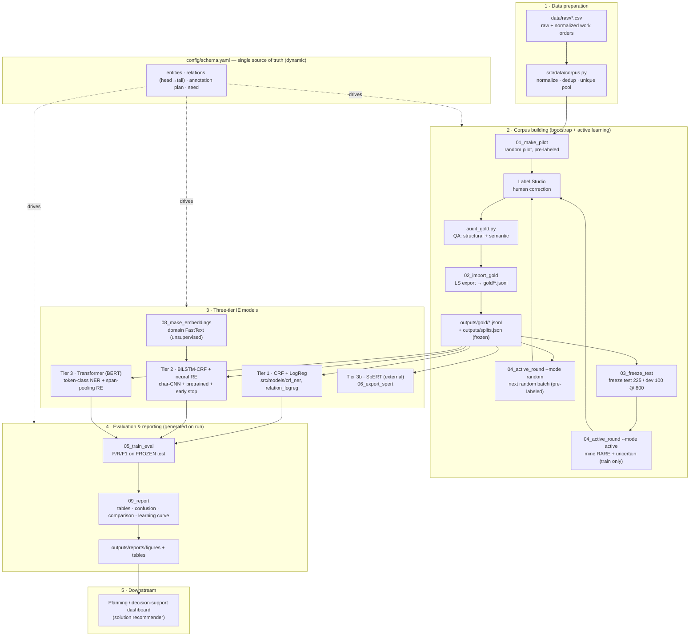

# Pipeline Map — AviMaint-DSS-IE

The whole system, end to end. Everything below the dashed line is driven by
`config/schema.yaml` (the schema + annotation plan), which is why the pipeline is
**dynamic**: change the schema and every stage adapts.

## How to read it

- **Top:** `config/schema.yaml` is the control panel. It defines the label set,
  the relation constraints, the batch sizes, and the seed. The dashed arrows show
  that it drives annotation, modelling, and evaluation alike.
- **Left-to-right within a stage** is the data flow; **the loop** in stage 2
  (`gold → active_round → Label Studio → import → gold`) is the human-in-the-loop
  bootstrap that grows the corpus.
- **The freeze** (`03_freeze_test`) is the honesty guarantee: once the test/dev
  sets are frozen at 800 records, active learning only ever grows the *training*
  pool, so reported F1 is never inflated.
- **Stage 4 artifacts are generated on run**, not shipped — run `09_report` and the
  figures/tables appear under `outputs/reports/`.

Open `pipeline_map.html` in a browser to see this rendered.

